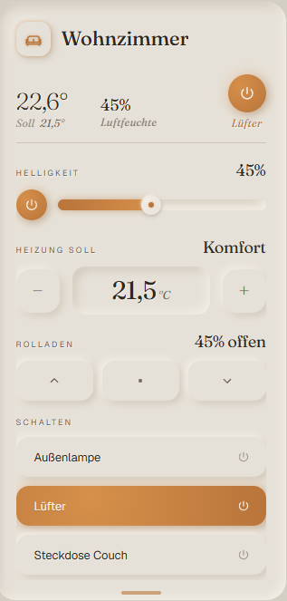

# Layr

> Distinctive Home Assistant cards. Built like furniture.

[](https://opensource.org/licenses/MIT)
[](https://github.com/maurice198444/layr/releases)
[](https://github.com/hacs/integration)

<p align="center">
  
</p>

---

## What is Layr?

Layr is a Home Assistant card pack with a deliberate visual identity.

Most HA custom cards optimize for flexibility — endless config options, every conceivable use case, generic Material icons. The result is dashboards that *work* but look like control panels. Layr takes a different approach: **fewer cards, designed with intent.** Each card has a strong visual identity, custom-drawn iconography, and considered interaction patterns. Like furniture — you don't need fifty chairs, you need one that feels right.

The pack is built around three ideas:

1. **A unified visual language.** Every card in the pack shares a design system — colors, typography, motion, shadows. They look like they belong together.
2. **Style packs over endless configuration.** Instead of a thousand config options, Layr will ship discrete visual themes (Monolith, Editorial, Cockpit, Brutalist). You pick a style; the cards adapt as a set.
3. **Quality over breadth.** Fewer cards, each one polished. The kind of card you'd actually want on the wall.

## What's in the pack?

Layr is structured as a **free core pack** plus a future **premium tier**. Both are part of the same codebase and use the same design system — Premium adds more cards and capabilities, never replaces or breaks the free ones.

### Free Card Pack — *MIT licensed, free forever*

| Card | Status | What it does |
|---|---|---|
| **Room Card** | ✅ *v0.1.0* | Adaptive multi-section card for an entire room — temperature, humidity, lights, climate, blinds, switches |
| **Hero Card** | ✅ *unreleased* | Featured value display with optional secondary value and recorder-backed sparkline |
| **Energy Card** | ✅ *unreleased* | Live energy-flow card for solar + battery setups — animated flow diagram with auto-detected operating mode |
| Stat Window | *planned* | Sensor readout with mini trend chart |
| Ticker Card | *planned* | Scrolling notifications and alerts |
| Divider Card | *planned* | Typographic section breaks for dashboards |

### Premium Card Pack — *Planned Q4 2026*

| Card | What it does |
|---|---|
| Battery Dial Card | Battery state with discharge/charge visualization |
| Light Card | Dedicated dimmer with color temperature controls |
| Climate Card | Dedicated thermostat with schedule preview |
| Cover Card | Dedicated blind/cover with tilt support |
| Media Player Card | Music/video with album art and queue |
| Calendar Card | Upcoming events with iconography |
| Energy Flow Card | Solar / battery / grid flow visualization |
| Camera Card | Live view with motion overlay |
| Scene Knobs Card | Tactile scene selector |

Plus **Style Packs** that re-skin the entire collection: *Editorial*, *Cockpit*, *Brutalist*. Pick the aesthetic that matches your space.

And eventually an **AI Dashboard Generator** (BYOK) — describe your home, get a configured dashboard.

### Pricing (planned)

- **Free** — €0, forever, all five core cards
- **Premium subscription** — €7/month
- **Premium lifetime** — €79 one-time

> The free cards are not a demo. They're genuinely useful as a complete set. Premium is for people who want the broader collection or the alternative style packs.

---

## Currently available — Room Card

The first card in the pack. A single adaptive component that handles temperature, humidity, lights, climate, blinds, and switches for an entire room. Sections render conditionally based on which entities you configure, so the same component works for a sensor-only hallway and a fully controllable living room.

**Features:**

- Temperature display with target temperature annotation
- Humidity readout as separate block
- Configurable quick-access button in the header
- Expandable controls panel:
  - Light brightness slider (auto-detects dimming support)
  - Climate setpoint stepper with long-press
  - Cover/blind controls (up · stop · down)
  - Switch pills for room devices
- Custom hand-drawn icons for 10 room types
- Adaptive layout — sections appear only for configured entities

**Configuration example:**

```yaml
type: custom:layr-room-card
name: Wohnzimmer
icon: sofa
temperature_entity: sensor.wohnzimmer_temperature
humidity_entity: sensor.wohnzimmer_humidity
light_entity: light.wohnzimmer_decke
climate_entity: climate.wohnzimmer
cover_entity: cover.wohnzimmer_rolladen
quick_access:
  entity: switch.luefter
  name: Lüfter
switches:
  - entity: switch.aussenlampe
    name: Außenlampe
  - entity: switch.steckdose_couch
    name: Steckdose Couch
```

See [`docs/room-card.md`](docs/room-card.md) for complete configuration reference, all options, and available icons.

---

## Also available — Hero Card

A featured-value display for a single entity. A large Fraunces number on the Monolith surface, with an optional secondary value and an optional sparkline drawn from Home Assistant's recorder history. Use it for the readings that deserve a headline — power draw, indoor temperature, humidity, air quality.

**Features:**

- Large serif headline value with auto-formatted unit
- Optional secondary value (e.g. a live reading paired with a daily total)
- Optional sparkline — lazy history fetch, auto-scaled, refreshed every 2 minutes, hidden when there's no data
- Custom hand-drawn measurement glyphs (bolt, thermometer, drop, gauge, leaf, sun …)
- Tap to open more-info (configurable, keyboard accessible)

**Configuration example:**

```yaml
type: custom:layr-hero-card
entity: sensor.haus_power
name: Stromverbrauch
icon: bolt
unit: W
secondary_entity: sensor.haus_power_today
secondary_name: Heute
sparkline: true
hours: 24
```

See [`docs/hero-card.md`](docs/hero-card.md) for complete configuration reference, all options, and available glyphs.

---

## Also available — Energy Card

A live energy-flow card for solar + battery setups, built with balcony solar plants (*Balkonkraftwerk*) in mind. It reads your current power flows, auto-detects the operating mode, and animates an energy-flow diagram — glowing particles travel along the active path while idle paths rest in the background.

**Features:**

- Auto-detected operating mode with its own status colour:
  - **Solarbetrieb** (green) — the sun covers consumption, surplus is exported
  - **Speicherbezug** (amber) — drawing from the battery
  - **Netzbezug** (red) — drawing from the grid
- Animated flow diagram with neumorphic Solar / Haus / Speicher / Netz nodes
- Computed headline + split per mode (e.g. self-consumption vs feed-in)
- Configurable stat column (up to four entities with optional bars)
- Sign-convention flags so it works with any integration's grid/battery sensors

**Configuration example:**

```yaml
type: custom:layr-energy-card
name: Balkonkraftwerk
icon: sun
solar_entity: sensor.bkw_leistung
house_entity: sensor.hausverbrauch
grid_entity: sensor.netzleistung
battery_entity: sensor.akku_leistung
battery_level_entity: sensor.akku_soc
stats:
  - { entity: sensor.bkw_heute, name: Heute, max: 5, tone: green }
  - { entity: sensor.akku_soc, name: Speicher, tone: green }
  - { entity: sensor.bkw_gespart, name: Gespart }
  - { entity: sensor.autarkie, name: Autarkie }
```

See [`docs/energy-card.md`](docs/energy-card.md) for the complete configuration reference, sign conventions, and mode logic.

---

## Installation

### Via HACS *(coming soon)*

> HACS Custom Repository support is planned for v0.2.0. Until then, install manually.

### Manual

1. Download `layr.js` from the [latest release](https://github.com/maurice198444/layr/releases)
2. Place it at `/config/www/community/layr/layr.js` in your HA installation
3. Register it as a Lovelace resource:
   - **Settings → Dashboards → ⋮ → Resources → Add Resource**
   - URL: `/local/community/layr/layr.js`
   - Type: **JavaScript Module**
4. Hard-refresh your browser (`Ctrl+Shift+R`)
5. Add a card via the dashboard editor

---

## Design Philosophy

Layr is built on the conviction that **smart-home dashboards should feel as considered as the homes they control.** Most current cards prioritize information density and configurability. Layr prioritizes:

- **Surfaces, not borders.** Cards are sculpted with neumorphic shadows, never outlined with `border: 1px solid`.
- **Editorial typography.** Numerical values use Fraunces (a refined contemporary serif). UI labels use Geist. Italic for annotations.
- **Considered motion.** Animations communicate state changes — they never decorate. 300–400ms ease curves throughout.
- **Custom iconography.** Every icon is hand-drawn for the pack. No FontAwesome, no Material Icons.
- **Conditional rendering.** Every section appears only when its data exists. The card adapts to what you have.

### The Monolith style — Layr's primary identity

The default look of all Layr cards. Warm cream surfaces (`#e6e1d8`), a tobacco accent (`#b8743a`), and Fraunces serif for numbers. Designed to feel **anti-Apple-Home, anti-Material-default** — closer to refined Bauhaus furniture than to a generic device UI.

Future style packs (planned for Premium) will re-skin the same component architecture with different visual languages: *Editorial* (more typographic, magazine-style), *Cockpit* (utilitarian, dense), *Brutalist* (raw, geometric).

---

## Roadmap

### Phase 1 — Free Card Pack *(Q3 2026)*
- ✅ Room Card *(v0.1.0)*
- ✅ Hero Card *(unreleased)*
- ✅ Energy Card *(unreleased)*
- ⬜ Stat Window Card
- ⬜ Ticker Card
- ⬜ Divider Card
- ⬜ HACS submission
- ⬜ Visual editor (point-and-click YAML configuration)
- ⬜ Documentation site at layr.de

### Phase 2 — Premium Tier *(Q4 2026)*
- ⬜ Nine Premium cards (see list above)
- ⬜ Style packs (Editorial, Cockpit, Brutalist)
- ⬜ License server + Stripe checkout
- ⬜ Premium documentation

### Phase 3 — AI Dashboard Generator *(2027)*
- ⬜ Backend generator (server-side LLM integration)
- ⬜ BYOK configuration (OpenAI · Anthropic · local)
- ⬜ Template library

> These are honest estimates from a developer with limited weekly hours. Timelines will slip. The free cards will ship.

---

## Development

If you want to build from source, modify cards, or contribute:

```bash
git clone https://github.com/maurice198444/layr.git
cd layr
npm install
npm run build       # produces dist/layr.js
npm run deploy      # builds + copies to your HA mount
```

See [`SETUP.md`](SETUP.md) for the full development workflow.

### Contributing

Contributions welcome — see [CONTRIBUTING.md](CONTRIBUTING.md). For bug reports and feature requests, use the appropriate issue template.

---

## Acknowledgments

This project owes thinking to:

- **[mushroom](https://github.com/piitaya/lovelace-mushroom)** — for proving that good design matters in HA dashboards
- **[button-card](https://github.com/custom-cards/button-card)** — for the flexibility blueprint
- **[Ultra Card](https://github.com/WJDDesigns/ultra-card)** — for the modular component philosophy
- **The HA Lovelace developer community** — for keeping the dashboard ecosystem alive

---

## License

MIT — see [LICENSE](LICENSE).

The Free Card Pack and all code in this repository is and stays open source under MIT. Premium-tier code (when it ships) will live in a separate repository with a commercial license.

---

<p align="center"><i>Made in Duisburg.</i></p>
